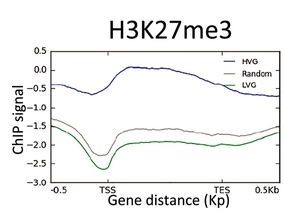

## The role of chromatin in controlling the level of inter-plant variability

Based on previous observation in [Cortijo et al., 2019](https://link.springer.com/article/10.15252/msb.20188591), the aim of this project is to explore the role of chromatin in regulating the level of inter-plant gene expression variability.  

Figure from Cortijo et al., 2019 showing the distribution of the chromatin mark H3K27me3 and the histone variant H2A.Z at 

  

    
  

  

    
 Figure from Cortijo et al., 2019 showing  .

  

### Global approaches 

### Team members working on this project

  

    
  

  

    
 The main person working on this project is Charlotte Lecuyer, a PhD student 

  

 

Previous team members involved: 
- Alexandre Vettor (Research Engineer)
- Oscar Main (Master student)
- Kenneth Schöneck (Master student)

