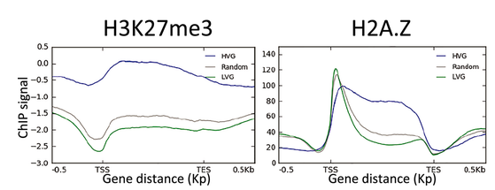

[Back to main page](https://scortijo.github.io/sandra.cortijo/)

 

## The role of chromatin in controlling the level of inter-plant variability

Based on previous observation in [Cortijo et al., 2019](https://link.springer.com/article/10.15252/msb.20188591), the aim of this project is to explore the role of chromatin in regulating the level of inter-plant gene expression variability.  

   
Figure from [Cortijo et al., 2019](https://link.springer.com/article/10.15252/msb.20188591) showing the distribution of the chromatin mark H3K27me3 and the histone variant H2A.Z at genes with a high inter-plant variability (HVG in blue), genes with a low level of inter-plant variability (LVG in green) and random genes (in grey). We can see that genes with a high level of inter-plant gene expression variability have a specific chromatin environment: high levels of H3K27me and H2A.Z. The project thus aims at defining the role of H3K27me and H2A.Z in controlling the level of inter-plant gene expression variability.

### Global approaches 

We use transcriptomics and epigenomics to analyse the role of chromatin in regulating inter-plant variability in gene expression. We also develop statistical tools in order to analyse inter-plant variability as the existing tools are focused on the detection of differential expression between 2 samples.

Combined with classical genetics approaches and imaging, this gives us the power to analyse inter-plant variability at a global scale and not just at a few genes.

### Team members working on this project

  

    
  

  

    
  
     
     The main person working on this project is **Charlotte Lecuyer**, a PhD student 
      
       

  

 

*Previous team members involved:*
- Alexandre Vettor (Research Engineer)
- Oscar Main (Master student)
- Kenneth Schöneck (Master student)

 

[Back to main page](https://scortijo.github.io/sandra.cortijo/)