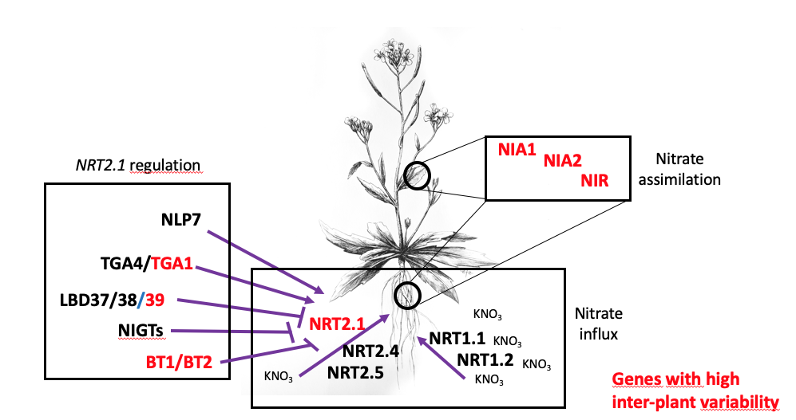
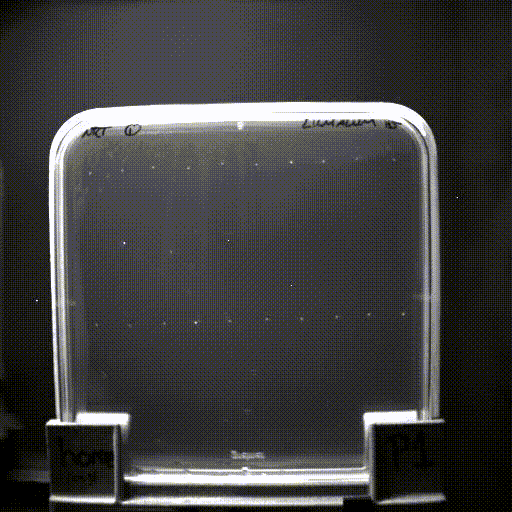

[Back to main page](https://scortijo.github.io/sandra.cortijo/)

 

## Regulation of inter-plant variability for genes involved in nitrate nutrition

Many genes involved in nitrate nutrition have a high level of inter-plant variability for their expression. We decided to focus on *NRT2.1*, one of the main transporters of nitrate, that has a high level of inter-plant gene expression variability and for which gene regulation is well known. The aim of this project is to understand how the level of *NRT2.1* gene expression inter-plant variability is controlled, when differences are established between plants and what are the consequences of this variability.   

 

### Live luciferase imaging

Using luciferase imaging, we can follow *NRT2.1* promoter activity in individual plants as they grow. This way, we can characterize in depth the regulation of inter-plant variability for this gene. Live luciferase imaging is done in collaboration with [Hélène Javot](https://www.cite-des-energies.fr/chercheur/helene-javot/?lang=en). Together with transcriptomics, we have to power to define when and how inter-plant variability is established for *NRT2.1* gene expression.

 

**Recent results of this project are published in [Lecuyer, Vettor et al,. 2025](https://journals.plos.org/plosgenetics/article?id=10.1371/journal.pgen.1011984)**

 

### Team members working on this project

The main person in charge of the project is currently Sandra Cortijo

The team members who were involved in the project are:
- Charlotte Lecuyer (PhD student)
- Alexandre Vettor (Research Engineer)
- Mona Mazouzi (Bachelor student)

 

[Back to main page](https://scortijo.github.io/sandra.cortijo/)