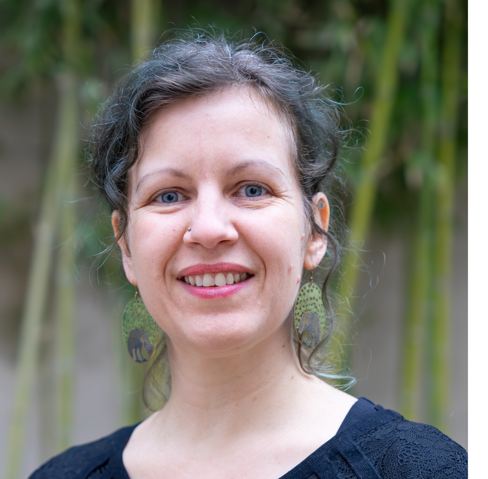
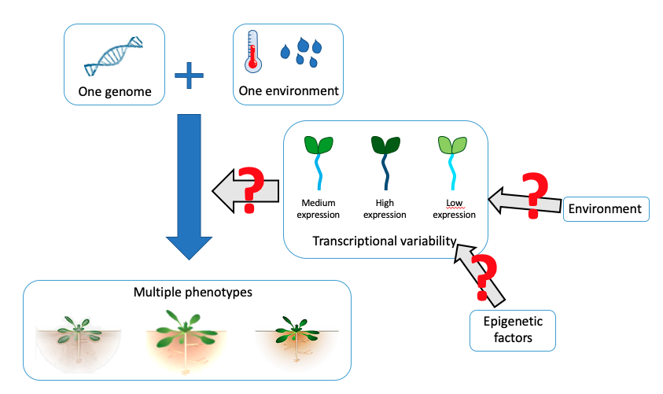

## About me

  

    
  

  

    
 I am a molecular geneticist and work on the role and regulation of inter-plant variability. Genetically identical plants, grown in the same environment, still show phenotypic differences. This inter-plant variability has been observe for many phenotypes like plant size, flowering time but also for gene expression as well as proteins and metabolites abundance.

  

To know more about me, see my [short CV](files/CV.md)

 

## Ongoing research projects

  
Our research projects focus on identifying the factors that regulate inter-plant variability and exploring its functional role. We currently have 3 projects ongoing and are interconnected to reach these goals. You can find an overview of the projects in [this seminar](https://www.youtube.com/watch?v=31X57xWZ0iE). 

 

### Regulation of inter-plant variability for genes involved in nitrate nutrition

We found that one of the main transporters of nitrate, *NRT2.1*, has a high level of inter-plant gene expression variability. The aim of this project is to understand how the level of *NRT2.1* gene expression inter-plant variability is controlled, when differences are established between plants and what are the consequences of this variability.   
You can find a more detailed description of the project [here](files/NRT2.md)

 

### The role of chromatin in controlling the level of inter-plant variability

Based on previous observation in [Cortijo et al., 2019](https://link.springer.com/article/10.15252/msb.20188591), the aim of this project is to explore the role of chromatin in regulating the level of inter-plant gene expression variability.  
You can find a more detailed description of the project [here](files/Chromatin.md)

 

### Influence of the environment on the level of inter-plant variability

While inter-plant variability is now recognized as widespread, observed across phenotypes such as plant size, flowering time, gene expression, and the abundance of proteins and metabolites, its response to environmental changes remains largely unexplored. The aim of this project is to characterize and understand the response of inter-plant variability to changes in the environment.  
You can find a more detailed description of the project [here](files/Environment.md)

 

## Tools

I developed 2 shiny applications to explore results from papers:  

- [Aranoisy](https://jlgroup.shinyapps.io/AraNoisy/), to follow the level of inter-plant variability in gene expression for your gene of interest in *Arabidopsis thaliana* throughout a day/night cycle.  

- [Variability Network](https://jlgroup.shinyapps.io/VariabilityNetwork/) to examine gene expression networks inferred using inter-plant variability in gene expression.  

## Recent publications

Here are the most recent publications. For a full list of publications, look at my [ORCID page](https://orcid.org/0000-0003-3291-6729).  

- Lecuyer C, Vettor A, Fizames C, Javot H, Martin A, Mazouzi M, Montané M.-H., **Cortijo S**. Establishment and maintenance of NRT2.1 inter-individual variability in plants. PLoS Genet. 2025 Dec;21: e1011984. [doi:10.1371/journal.pgen.1011984](https://journals.plos.org/plosgenetics/article?id=10.1371/journal.pgen.1011984)  
- Coroenne C, Lecuyer C, Martin A, **Cortijo S**. Individual variability in plants: From intra- to inter-individual variability and its response to the environment. Curr Opin Plant Biol. 2025 Dec;89: 102833. [doi:10.1016/j.pbi.2025.102833](https://www.sciencedirect.com/science/article/pii/S1369526625001475)  
- **Cortijo S**, Aydin Z, Ahnert S, Locke JC. Widespread inter-individual gene expression variability in Arabidopsis thaliana. Mol Syst Biol. 2019 Jan 24;15(1):e8591.  doi:10.15252/msb.20188591](https://link.springer.com/article/10.15252/msb.20188591)   

 

## Contact me :
If you want to apply for a position, would like to collaborate or have any question, you can contact me at `sandra.cortijo (at) cnrs (point) fr`

 

